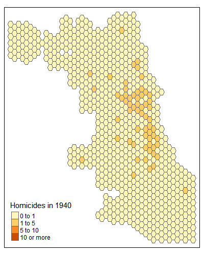
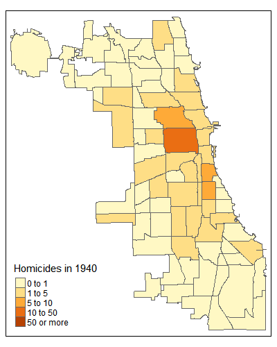

```{r setup, include=FALSE}
knitr::opts_chunk$set(echo = TRUE)
```

# Map Visualizations for Cook County Homicides, 1940-1965

## Loading packages

The following R packages will be needed:

```{r packages, results=FALSE, message=FALSE, warning=FALSE}
library(sf)
library(dplyr)
library(tmap)
library(leaflet)
library(leafgl)
library(crosstalk)
library(sfdep)
```

## Loading Data

The homicide and geographic boundary data are loaded in. Note that 58 homicide data points had no geography associated with them and thus had to be dropped for spatial analysis.

```{r load_data, results=FALSE, message=FALSE, warning=FALSE}
homicides = read_sf("homicides_1940-1965_geocoded_v2/homicides_1940-1965_geocoded_v2.shp") %>% filter(!st_is_empty(.))
city_bounds = read_sf("Chicago_City_Limits-shp/Chicago_City_Limits.shp") %>% st_transform(st_crs(homicides))
hexagons = read_sf("hexagons/hexagons.shp") %>% st_transform(st_crs(homicides))
CAs = read_sf("Boundaries - Community Areas (current)/geo_export_e916a3b4-0ea3-4ca2-944a-cb060aacf705.shp") %>% st_transform(st_crs(homicides))
```

## Simple Placement Map

A small amount of "jitter" is applied to points in order to make overlapping points both visible:

```{r jitter points, results=FALSE, message=FALSE, warning=FALSE}
homicides_jitter = st_jitter(homicides, factor = 0.0001)
```

An interactive map of homicides:

```{r placement_map, message=FALSE, warning=FALSE}
leaflet(homicides_jitter) %>%
  addProviderTiles(providers$Esri.WorldGrayCanvas) %>%
  addPolygons(data = city_bounds, opacity = 0.2) %>%
  addGlPoints(homicides_jitter, radius = 2, fillColor = "black")
```

## Choropleth Maps

### Hexagons

Spatial count of homicides per hexagon:

```{r hexagons_spatial_count, results=FALSE, message=FALSE, warning=FALSE}
# Assign each point the grid ID of its surrounding hexagon
homicides_hex_joined = st_join(homicides, hexagons, join = st_within)

# Create table of frequency by hexagon
hex_freq_table = as.data.frame(table(homicides_hex_joined$GRID_ID)) %>% rename(GRID_ID = Var1, hom_ct = Freq)

# Merge frequency table back into hexes
hexagons_hom_ct = hexagons %>% left_join(hex_freq_table, by = "GRID_ID") %>% mutate(hom_ct = ifelse(is.na(hom_ct), 0, hom_ct))
```

Viewing the hexagons:

```{r hex_map, message=FALSE, warning=FALSE}
tmap_mode("view")
tm_shape(hexagons_hom_ct) + tm_polygons(col = "hom_ct", breaks = c(0,1,5,10,50,100,500,Inf), title="Homicides", id="hom_ct", popup.vars = c("Grid ID:" = "GRID_ID", "Homicides:" = "hom_ct"))
```

Note that a custom classification scheme is used because of the extreme skew of the data. The 0 to 1 bin shows hexes where no homicide incidents occurred at all.

### Community Areas

Spatial count of homicides per community area:

```{r CAs_spatial_count, results=FALSE, message=FALSE, warning=FALSE}
# Assign each point the grid ID of its surrounding hexagon
homicides_CA_joined = st_join(homicides, CAs, join = st_within)

# Create table of frequency by hexagon
CA_freq_table = as.data.frame(table(homicides_CA_joined$area_num_1)) %>% rename(area_num_1 = Var1, hom_ct = Freq)

# Merge frequency table back into hexes
CAs_hom_ct = CAs %>% left_join(CA_freq_table, by = "area_num_1") %>% mutate(hom_ct = ifelse(is.na(hom_ct), 0, hom_ct))
```

Viewing the community areas:

```{r CAs_map, message=FALSE, warning=FALSE}
tmap_mode("view")
tm_shape(CAs_hom_ct) + tm_polygons(col = "hom_ct", breaks = c(0,1,5,10,50,100,500,Inf), title="Homicides", id="hom_ct", popup.vars = c("Area Name:" = "community", "Homicides:" = "hom_ct"))
```

The same classification scheme is used for consistency, though it should be noted that community areas are generally larger than hexagons.

## Time Series Placement Map

First, homicide dates must be converted into date format. Then `SharedData` from crosstalk is used to link data between the slider and the map below:

```{r hom_shared_data, results=FALSE, message=FALSE, warning=FALSE}
homicides_jitter$start = as.Date(homicides_jitter$date, format = "%m/%d/%Y")
shared_data = SharedData$new(homicides_jitter)
```

The map:

```{r hom_time_series, message=FALSE, warning=FALSE}
filter_slider("date", "Date", shared_data, ~start, width = "100%")
leaflet(shared_data) %>%
  addProviderTiles(providers$Esri.WorldGrayCanvas) %>%
  addPolygons(data = city_bounds, opacity = 0.2) %>%
  addCircleMarkers(radius = 1, weight = 0.2, color = "black")
```

## Time Series Choropleth Maps

### Hexagons

Spatial count of homicides per hexagon for each year:

```{r hexagons_spatial_count_yr, results=FALSE, message=FALSE, warning=FALSE}
# Create table of frequency by hexagon and year
hex_freq_table_yr = as.data.frame(table(homicides_hex_joined$GRID_ID, homicides_hex_joined$year)) %>% rename(GRID_ID = Var1, year = Var2, hom_ct = Freq)

# Convert factors to integers/strings
hex_freq_table_yr$GRID_ID = as.character(paste(hex_freq_table_yr$GRID_ID))
hex_freq_table_yr$year = as.integer(paste(hex_freq_table_yr$year))

# Create an expanded grid of hexagons that includes each hex/year combo
hexagons_yr = expand.grid(GRID_ID = hexagons$GRID_ID, year = 1940:1964) %>% left_join(hexagons, by = "GRID_ID") %>% st_as_sf()

# Merge frequency table back hex/year grid
hexagons_hom_ct_yr = hexagons_yr %>% left_join(hex_freq_table_yr, join_by(GRID_ID, year)) %>% mutate(hom_ct = ifelse(is.na(hom_ct), 0, hom_ct))
```

Creating a list of hexagon maps:

```{r hex_map_yr, message=FALSE, warning=FALSE}
hex_map_list = list()

for (n in 1940:1964) {
  data = hexagons_hom_ct_yr %>% filter(year == n)
  map = tm_shape(data) + tm_polygons(col = "hom_ct", breaks = c(0, 1, 5, 10, Inf), title = paste("Homicides in", n))
  hex_map_list[[n-1939]] = map
  rm(n, data, map)
}
```

Finally, the `tmap_animation` function was used to create the animation presented below:

```{r hex_map_yr_animate, eval=FALSE, message=FALSE, warning=FALSE}
tmap_animation(hex_map_list, "hex_map_list.gif", width = 400, height = 500, delay = 100)
```



### Community Areas

A similar set of code is used to create an animation of homicides per Community Area for each year:

```{r CAs_spatial_count_yr, results=FALSE, message=FALSE, warning=FALSE}
# Create table of frequency by CA and year
CA_freq_table_yr = as.data.frame(table(homicides_CA_joined$area_num_1, homicides_CA_joined$year)) %>% rename(area_num_1 = Var1, year = Var2, hom_ct = Freq)

# Convert factors to integers/strings
CA_freq_table_yr$area_num_1 = as.character(paste(CA_freq_table_yr$area_num_1))
CA_freq_table_yr$year = as.integer(paste(CA_freq_table_yr$year))

# Create an expanded grid of CAs that includes each CA/year combo
CAs_yr = expand.grid(area_num_1 = CAs$area_num_1, year = 1940:1964) %>% left_join(CAs, by = "area_num_1") %>% st_as_sf()

# Merge frequency table back CA/year grid
CAs_hom_ct_yr = CAs_yr %>% left_join(CA_freq_table_yr, join_by(area_num_1, year)) %>% mutate(hom_ct = ifelse(is.na(hom_ct), 0, hom_ct))
```

Creating a list of community area maps:

```{r CA_map_yr, message=FALSE, warning=FALSE}
CA_map_list = list()

for (n in 1940:1964) {
  data = CAs_hom_ct_yr %>% filter(year == n)
  map = tm_shape(data) + tm_polygons(col = "hom_ct", breaks = c(0, 1, 5, 10, 50, Inf), title = paste("Homicides in", n))
  CA_map_list[[n-1939]] = map
  rm(n, data, map)
}
```

Finally, the `tmap_animation` function was used to create the animation presented below:

```{r CA_map_yr_animate, eval=FALSE, message=FALSE, warning=FALSE}
tmap_animation(CA_map_list, "CA_map_list.gif", width = 400, height = 500, delay = 100)
```



## Directional Distribution

The following code creates and visualizes the standard deviational ellipse for the homicide data:

```{r sde, message=FALSE, warning=FALSE}
sde_data = std_dev_ellipse(homicides)
sde = st_ellipse(geometry = sde_data, sx = sde_data$sx, sy = sde_data$sy, rotation = -sde_data$theta)

leaflet(homicides_jitter) %>%
  addProviderTiles(providers$Esri.WorldGrayCanvas) %>%
  addGlPoints(homicides_jitter, radius = 2, fillColor = "black") %>%
  addPolygons(data = sde, opacity = 0.2)
```
