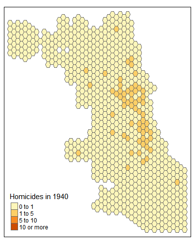
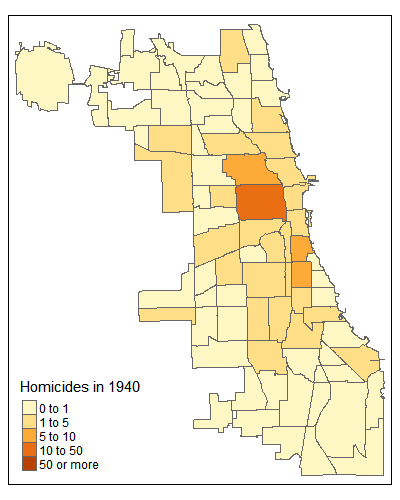
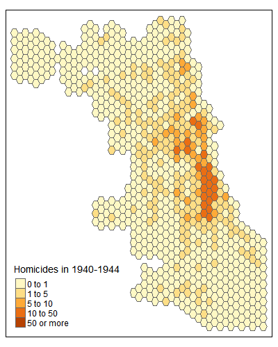
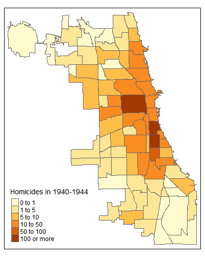
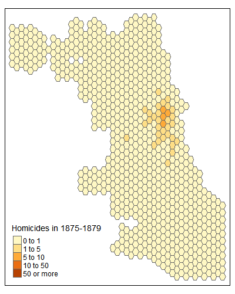
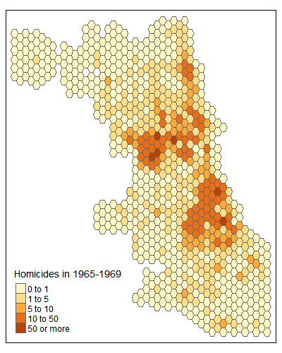

```{r setup, include=FALSE}
knitr::opts_chunk$set(echo = TRUE)
```

# Part 1: Map Visualizations for Cook County Homicides, 1940-1965

## Loading packages

The following R packages will be needed:

```{r packages, results=FALSE, message=FALSE, warning=FALSE}
library(sf)
library(dplyr)
library(tmap)
library(leaflet)
library(leafgl)
library(crosstalk)
library(sfdep)
```

## Loading Data

The homicide and geographic boundary data are loaded in. Note that 83 homicide data points had no geography associated with them and thus had to be dropped for spatial analysis. An additional 6 data points had no date, and had to be dropped as well.

```{r load_data, results=FALSE, message=FALSE, warning=FALSE}
# Load in homicide data and remove entries with missing geometry (n=83) and missing date (n=6)
homicides = read_sf("homicides_1940-1965_geocoded_v3/homicides_1940-1965_geocoded_v3.shp") %>% filter(!st_is_empty(.)) %>% filter(date != "NaT")

city_bounds = read_sf("Chicago_City_Limits-shp/Chicago_City_Limits.shp") %>% st_transform(st_crs(homicides))
hexagons = read_sf("hexagons/hexagons.shp") %>% st_transform(st_crs(homicides))
CAs = read_sf("Boundaries - Community Areas (current)/geo_export_e916a3b4-0ea3-4ca2-944a-cb060aacf705.shp") %>% st_transform(st_crs(homicides))
```

## Simple Placement Map

A small amount of "jitter" is applied to points in order to make overlapping points both visible:

```{r jitter points, results=FALSE, message=FALSE, warning=FALSE}
homicides_jitter = st_jitter(homicides, factor = 0.0001)
```

An interactive map of homicides:

```{r placement_map, message=FALSE, warning=FALSE}
leaflet(homicides_jitter) %>%
  addProviderTiles(providers$Esri.WorldGrayCanvas) %>%
  addPolygons(data = city_bounds, opacity = 0.2) %>%
  addGlPoints(homicides_jitter, radius = 2, fillColor = "black")
```

**Preliminary findings:** Homicides 1940-1964 were concentrated primarily on the South and West Sides, with a smaller cluster appearing along the lake shore to the north as well. The Northwest and Southwest sides had a far lower concentration of homicides, though this may be due to lower population density at the time. On a more local scale, homicides tend to cluster around major thoroughfares, like Madison St on the West Side.

## Choropleth Maps

### Hexagons

Spatial count of homicides per hexagon:

```{r hexagons_spatial_count, results=FALSE, message=FALSE, warning=FALSE}
# Assign each point the grid ID of its surrounding hexagon
homicides_hex_joined = st_join(homicides, hexagons, join = st_within)

# Create table of frequency by hexagon
hex_freq_table = as.data.frame(table(homicides_hex_joined$GRID_ID)) %>% rename(GRID_ID = Var1, hom_ct = Freq)

# Merge frequency table back into hexes
hexagons_hom_ct = hexagons %>% left_join(hex_freq_table, by = "GRID_ID") %>% mutate(hom_ct = ifelse(is.na(hom_ct), 0, hom_ct))
```

Viewing the hexagons:

```{r hex_map, message=FALSE, warning=FALSE}
tmap_mode("view")
tm_shape(hexagons_hom_ct) + tm_polygons(col = "hom_ct", breaks = c(0,1,5,10,50,100,Inf), title="Homicides", id="hom_ct", popup.vars = c("Grid ID:" = "GRID_ID", "Homicides:" = "hom_ct"))
```

Note that a custom classification scheme is used because of the extreme skew of the data. The 0 to 1 bin shows hexes where no homicide incidents occurred at all.

### Community Areas

Spatial count of homicides per community area:

```{r CAs_spatial_count, results=FALSE, message=FALSE, warning=FALSE}
# Assign each point the grid ID of its surrounding CA
homicides_CA_joined = st_join(homicides, CAs, join = st_within)

# Create table of frequency by CA
CA_freq_table = as.data.frame(table(homicides_CA_joined$area_num_1)) %>% rename(area_num_1 = Var1, hom_ct = Freq)

# Merge frequency table back into CAs
CAs_hom_ct = CAs %>% left_join(CA_freq_table, by = "area_num_1") %>% mutate(hom_ct = ifelse(is.na(hom_ct), 0, hom_ct))
```

Viewing the community areas:

```{r CAs_map, message=FALSE, warning=FALSE}
tmap_mode("view")
tm_shape(CAs_hom_ct) + tm_polygons(col = "hom_ct", breaks = c(0,1,5,10,50,100,500,Inf), title="Homicides", id="hom_ct", popup.vars = c("Area Name:" = "community", "Homicides:" = "hom_ct"))
```

The same classification scheme is used for consistency, though it should be noted that community areas are generally larger than hexagons. Thus, homicides exceed 500 in certain areas, and so an extra bin, "500 or more", is added here.

**Preliminary findings:** As seen above, homicides tend to cluster in the South and West Sides. However, while placement maps are generally good at highlighting areas of high concentration, the two choropleth maps above elucidate areas of low concentration as well, such as the community area of North Park, which had 0 homicides during the entire time period. These results should be interpreted with caution, however, as they are not population standardized, and may simply be apparent due to a lack of population density.

## Time Series Placement Map

First, homicide dates must be converted into date format. Then `SharedData` from crosstalk is used to link data between the slider and the map below:

```{r hom_shared_data, results=FALSE, message=FALSE, warning=FALSE}
homicides_jitter$start = as.Date(homicides_jitter$date)
shared_data = SharedData$new(homicides_jitter)
```

The map:

```{r hom_time_series, message=FALSE, warning=FALSE}
filter_slider("date", "Date", shared_data, ~start, width = "100%")
leaflet(shared_data) %>%
  addProviderTiles(providers$Esri.WorldGrayCanvas) %>%
  addPolygons(data = city_bounds, opacity = 0.2) %>%
  addCircleMarkers(radius = 1, weight = 0.2, color = "black")
```

**Preliminary findings:** The interactive map above illustrates the outward spread of homicides in Chicago over time, likely paralleled by the city's outward growth. However, the change in concentration of homicides in the West Side is quite notable; while in 1940 homicides appear to be no more concentrated on the West Side than any other area of the city, by 1964 they are just as concentrated in that area, if not more, than on the South Side.

## Time Series Choropleth Maps

### Hexagons

Spatial count of homicides per hexagon for each year:

```{r hexagons_spatial_count_yr, results=FALSE, message=FALSE, warning=FALSE}
# Create table of frequency by hexagon and year
hex_freq_table_yr = as.data.frame(table(homicides_hex_joined$GRID_ID, homicides_hex_joined$year)) %>% rename(GRID_ID = Var1, year = Var2, hom_ct = Freq)

# Convert factors to integers/strings
hex_freq_table_yr$GRID_ID = as.character(paste(hex_freq_table_yr$GRID_ID))
hex_freq_table_yr$year = as.integer(paste(hex_freq_table_yr$year))

# Create an expanded grid of hexagons that includes each hex/year combo
hexagons_yr = expand.grid(GRID_ID = hexagons$GRID_ID, year = 1940:1964) %>% left_join(hexagons, by = "GRID_ID") %>% st_as_sf()

# Merge frequency table back into hex/year grid
hexagons_hom_ct_yr = hexagons_yr %>% left_join(hex_freq_table_yr, join_by(GRID_ID, year)) %>% mutate(hom_ct = ifelse(is.na(hom_ct), 0, hom_ct))
```

Creating a list of hexagon maps:

```{r hex_map_yr, message=FALSE, warning=FALSE}
hex_map_list = list()

for (n in 1940:1964) {
  data = hexagons_hom_ct_yr %>% filter(year == n)
  map = tm_shape(data) + tm_polygons(col = "hom_ct", breaks = c(0, 1, 5, 10, Inf), title = paste("Homicides in", n))
  hex_map_list[[n-1939]] = map
  rm(n, data, map)
}
```

Finally, the `tmap_animation` function is used to create the animation presented below:

```{r hex_map_yr_animate, eval=FALSE, message=FALSE, warning=FALSE}
tmap_animation(hex_map_list, "hex_map_list.gif", width = 400, height = 500, delay = 50)
```



### Community Areas

A similar set of code is used to create an animation of homicides per Community Area for each year:

```{r CAs_spatial_count_yr, results=FALSE, message=FALSE, warning=FALSE}
# Create table of frequency by CA and year
CA_freq_table_yr = as.data.frame(table(homicides_CA_joined$area_num_1, homicides_CA_joined$year)) %>% rename(area_num_1 = Var1, year = Var2, hom_ct = Freq)

# Convert factors to integers/strings
CA_freq_table_yr$area_num_1 = as.character(paste(CA_freq_table_yr$area_num_1))
CA_freq_table_yr$year = as.integer(paste(CA_freq_table_yr$year))

# Create an expanded grid of CAs that includes each CA/year combo
CAs_yr = expand.grid(area_num_1 = CAs$area_num_1, year = 1940:1964) %>% left_join(CAs, by = "area_num_1") %>% st_as_sf()

# Merge frequency table back into CA/year grid
CAs_hom_ct_yr = CAs_yr %>% left_join(CA_freq_table_yr, join_by(area_num_1, year)) %>% mutate(hom_ct = ifelse(is.na(hom_ct), 0, hom_ct))
```

Creating a list of community area maps:

```{r CA_map_yr, message=FALSE, warning=FALSE}
CA_map_list = list()

for (n in 1940:1964) {
  data = CAs_hom_ct_yr %>% filter(year == n)
  map = tm_shape(data) + tm_polygons(col = "hom_ct", breaks = c(0, 1, 5, 10, 50, Inf), title = paste("Homicides in", n))
  CA_map_list[[n-1939]] = map
  rm(n, data, map)
}
```

Finally, the `tmap_animation` function is used to create the animation presented below:

```{r CA_map_yr_animate, eval=FALSE, message=FALSE, warning=FALSE}
tmap_animation(CA_map_list, "CA_map_list.gif", width = 400, height = 500, delay = 50)
```



**Preliminary findings:** Because homicides are somewhat sporadic events over the course of a 1-year timespan, there appears to be a lot of oscillation between frames. This indicates that a longer timespan should be used for each frame. The animations below present the results with a 5-year timespan instead of 1-year.

### 5-year Time Series Choropleth Maps

```{r 5yr_maps, eval=FALSE, message=FALSE, warning=FALSE}
hex_map_list_5yr = list()
CA_map_list_5yr = list()

for (n in seq(1940, 1964, 5)) {
  data = hexagons_hom_ct_yr %>% filter(between(year, n, n+4))
  aggregated_data = aggregate(data$hom_ct, list(data$GRID_ID), FUN = sum) %>% rename(GRID_ID = Group.1, hom_ct = x) %>% left_join(hexagons, by = "GRID_ID") %>% st_as_sf()
  map = tm_shape(aggregated_data) + tm_polygons(col = "hom_ct", breaks = c(0, 1, 5, 10, 50, Inf), title = paste0("Homicides in ", n, "-", n+4))
  hex_map_list_5yr[[1+((n-1940)/5)]] = map
  rm(n, data, aggregated_data, map)
}

for (n in seq(1940, 1964, 5)) {
  data = CAs_hom_ct_yr %>% filter(between(year, n, n+4))
  aggregated_data = aggregate(data$hom_ct, list(data$area_num_1), FUN = sum) %>% rename(area_num_1 = Group.1, hom_ct = x) %>% left_join(CAs, by = "area_num_1") %>% st_as_sf()
  map = tm_shape(aggregated_data) + tm_polygons(col = "hom_ct", breaks = c(0, 1, 5, 10, 50, 100, Inf), title = paste0("Homicides in ", n, "-", n+4))
  CA_map_list_5yr[[1+((n-1940)/5)]] = map
  rm(n, data, aggregated_data, map)
}

tmap_animation(hex_map_list_5yr, "hex_map_list_5yr.gif", width = 400, height = 500, delay = 100)
tmap_animation(CA_map_list_5yr, "CA_map_list_5yr.gif", width = 400, height = 500, delay = 100)
```




**Preliminary findings:** Now the outward spread of homicides is a bit clearer, especially in the CA animation above. However, some oscillation is still present.

## Directional Distribution

The following code creates and visualizes the standard deviational ellipse for the homicide data:

```{r sde, message=FALSE, warning=FALSE}
sde_data = std_dev_ellipse(homicides)
sde = st_ellipse(geometry = sde_data, sx = sde_data$sx, sy = sde_data$sy, rotation = -sde_data$theta)

leaflet(homicides_jitter) %>%
  addProviderTiles(providers$Esri.WorldGrayCanvas) %>%
  addGlPoints(homicides_jitter, radius = 2, fillColor = "black") %>%
  addPolygons(data = sde, opacity = 0.2)
```

**Preliminary findings:** Rather intuitively, the standard deviational ellipse encompasses the South and West Sides, with the Near North Side included as well. Future analysis could demonstrate the change of the ellipse's size and shape over time, which could demonstrate how the geographic distribution of homicides spread out in a more systematic way.

# Part 2: Map Visualizations for Cook County Homicides, 1874-1930 and 1965-2020

## Loading Data

A frequency table of homicides per hexagon before and after the time period shown above, compiled previously, is loaded in.

```{r pt2_load_data, results=FALSE, message=FALSE, warning=FALSE}
# Load in homicides per hexagon data
pt2_hex_freq_table_yr = read.csv("homicides_1874-2020_hex/homicides_pre_1931_post_1964.csv") %>% select(GRID_ID, year, hom_ct = homicides)
```

## Choropleth Maps

First, all homicides 1874-1930 and 1965-2020 are visualized using a simple choropleth map. Note that records between 1874-1930 include all homicides; records used in the above analysis of homicides between 1940-1964 only include murders, justifiable homicides, and cases in which the verdict is unclear; and records between 1965-2020 only include murders. Thus, the findings from each of these time periods are not directly comparable to each other.

```{r pt2_choropleth, results=FALSE, message=FALSE, warning=FALSE}
# Separate data between 1874-1930 and between 1965-2020
pt2_before_only = pt2_hex_freq_table_yr %>% filter(year < 1931) %>% select(GRID_ID, hom_ct)
pt2_after_only = pt2_hex_freq_table_yr %>% filter(year > 1964) %>% select(GRID_ID, hom_ct)

# Take aggregate of tables by GRID_ID
pt2_before_aggregated = aggregate(.~GRID_ID, data = pt2_before_only,FUN = sum)
pt2_after_aggregated = aggregate(.~GRID_ID, data = pt2_after_only, FUN = sum)

# Merge frequency table into hexes
pt2_before_hexagons_hom_ct = hexagons %>% left_join(pt2_before_aggregated, by = "GRID_ID")
pt2_after_hexagons_hom_ct = hexagons %>% left_join(pt2_after_aggregated, by = "GRID_ID")
```

Viewing the hexagons:

```{r pt2_hex_map, message=FALSE, warning=FALSE}
tmap_mode("view")
tm_shape(pt2_before_hexagons_hom_ct) + tm_polygons(col = "hom_ct", breaks = c(0,1,5,10,50,100,Inf), title="Homicides 1874-1930", id="hom_ct", popup.vars = c("Grid ID:" = "GRID_ID", "Homicides:" = "hom_ct"))
tm_shape(pt2_after_hexagons_hom_ct) + tm_polygons(col = "hom_ct", breaks = c(0,1,5,10,50,100,Inf), title="Homicides 1965-2020", id="hom_ct", popup.vars = c("Grid ID:" = "GRID_ID", "Homicides:" = "hom_ct"))
```

The same custom classification scheme described above is used here for consistency, though without the "500 or more" bin because it is not used.

**Preliminary findings:** These two maps further demonstrate how homicides have spread outward over time, well beyond the time period of 1940-1964.

## Time Series Choropleth Map

Next, time series animations like the ones shown above are created for hexagons between 1874-1930 and 1965-2020. A 5-year interval is used like before to reduce noise. Because of this, the years 1874, 1930, 2015, and 2016 will not be included, as they do not fit into any 5-year intervals.

```{r pt2_choropleth_time_series, results=FALSE, message=FALSE, warning=FALSE}
# Create an expanded grid of hexagons that includes each hex/year combo
pt2_hexagons_yr = expand.grid(GRID_ID = hexagons$GRID_ID, year = c(1874:1930, 1965:2020)) %>% left_join(hexagons, by = "GRID_ID") %>% st_as_sf()

# Merge into hexagons
pt2_hexagons_hom_ct_yr = pt2_hexagons_yr %>% left_join(pt2_hex_freq_table_yr, join_by(GRID_ID, year))
```

Creating a list of hexagon maps:

```{r pt2_hex_map_yr, message=FALSE, warning=FALSE}
pt2_map_list_before = list()
pt2_map_list_after = list()

for (n in seq(1875, 1929, 5)) {
  data = pt2_hexagons_hom_ct_yr %>% filter(between(year, n, n+4))
  aggregated_data = aggregate(data$hom_ct, list(data$GRID_ID), FUN = sum) %>% rename(GRID_ID = Group.1, hom_ct = x) %>% left_join(hexagons, by = "GRID_ID") %>% st_as_sf()
  map = tm_shape(aggregated_data) + tm_polygons(col = "hom_ct", breaks = c(0, 1, 5, 10, 50, Inf), title = paste0("Homicides in ", n, "-", n+4))
  pt2_map_list_before[[1+((n-1875)/5)]] = map
  rm(n, data, aggregated_data, map)
}

for (n in seq(1965, 2014, 5)) {
  data = pt2_hexagons_hom_ct_yr %>% filter(between(year, n, n+4))
  aggregated_data = aggregate(data$hom_ct, list(data$GRID_ID), FUN = sum) %>% rename(GRID_ID = Group.1, hom_ct = x) %>% left_join(hexagons, by = "GRID_ID") %>% st_as_sf()
  map = tm_shape(aggregated_data) + tm_polygons(col = "hom_ct", breaks = c(0, 1, 5, 10, 50, Inf), title = paste0("Homicides in ", n, "-", n+4))
  pt2_map_list_after[[1+((n-1965)/5)]] = map
  rm(n, data, aggregated_data, map)
}
```

Finally, the `tmap_animation` function is used to create the two animations presented below:

```{r pt2_hex_map_yr_animate, eval=FALSE, message=FALSE, warning=FALSE}
tmap_animation(pt2_map_list_before, "hex_map_list_before.gif", width = 400, height = 500, delay = 100)
tmap_animation(pt2_map_list_after, "hex_map_list_after.gif", width = 400, height = 500, delay = 100)
```




**Preliminary findings:** The two animations above further demonstrate the spreading-out of homicides over time that parallels the outward growth of the city. The first animation, including homicides from 1865 to 1930, begins with homicides almost entirely concentrated in the city center. By 1925-1929, however, homicides are just as concentrated in the Near West and Near South Sides as they are in the city center. The latter animation also shows a diffusion of homicides over time, though also shows a decrease in their overall concentration within the last two time periods. It also suggests that the shape of this distribution has fundamentally changed over the past few decades -- from a hub-and-spoke shape centered on the Loop and reaching into the South, West, and North Sides in the 1960s to two distinct regions on the West and South Sides and no central concentration in the Loop in the 2010s.
